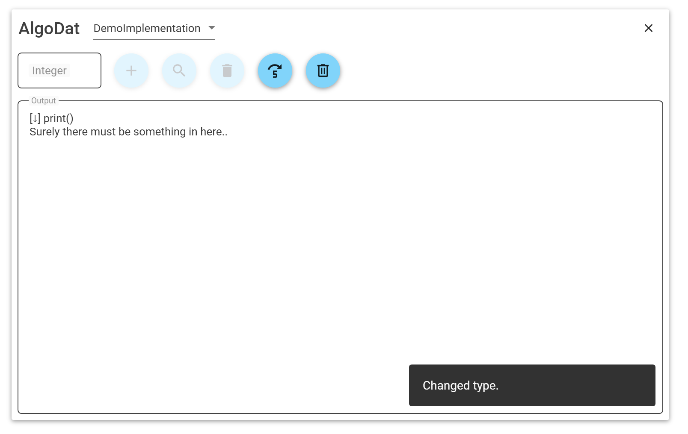

# AlgoDat

This is a simple, yet beautiful GUI to be used as a testbed for general datastructure implementations. It was created as part of project during the algorithm and datastructures course at the TH-N&uuml;rnberg.

Now I'm sharing it, so the following students don't have to reinvent the wheel and use ugly console applications to demo their implementations. Also, it demonstrates what's possible with just a few lines of code.

Currently, the application supports integer dictionaries only and has two convenience functions (add random, clear all).

I do not intend to update this anymore, however, I'm open to pull request.

